# 教師排課管理系統 - 系統流程圖

## 📋 目錄
1. [整體系統架構](#整體系統架構)
2. [認證流程](#認證流程)
3. [教師管理流程](#教師管理流程)
4. [派課管理流程](#派課管理流程)
5. [問卷管理流程](#問卷管理流程)
6. [權限檢查流程](#權限檢查流程)
7. [數據流架構](#數據流架構)

---

## 整體系統架構

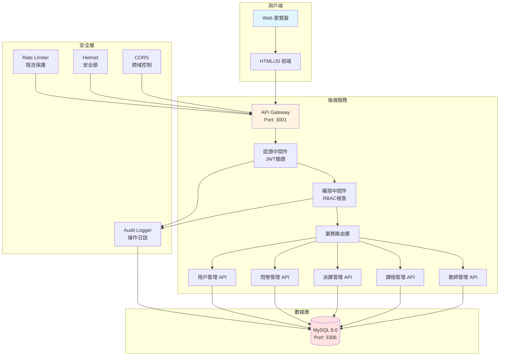

---

## 認證流程

### 用戶註冊與登錄

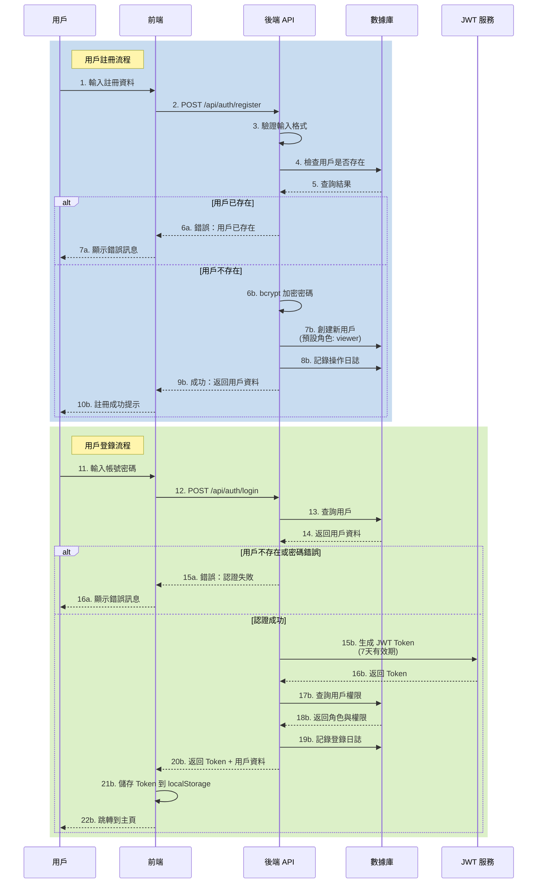

### API 請求認證

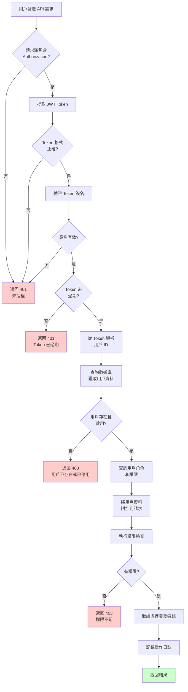

---

## 教師管理流程

### 新增/編輯教師

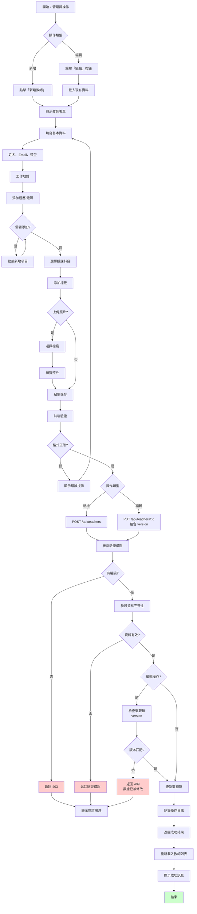

### 教師列表查詢

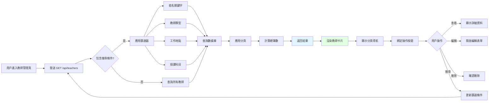

---

## 派課管理流程

### 派課流程（含衝突檢查）

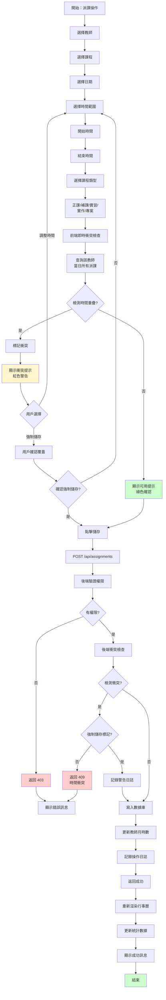

### 行事曆檢視

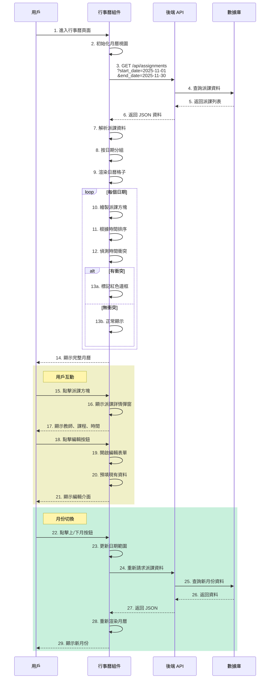

---

## 問卷管理流程

### 問卷創建與發布

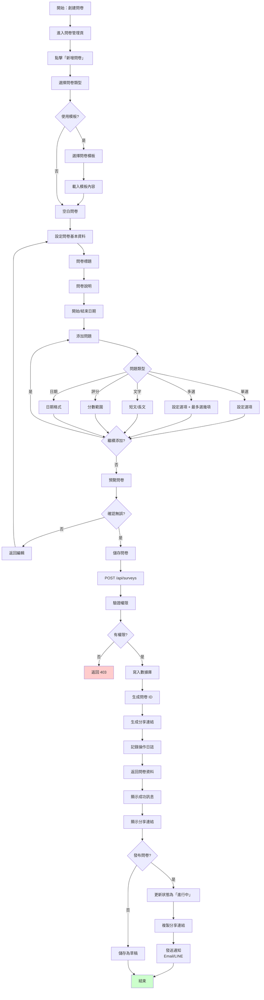

### 問卷填寫流程

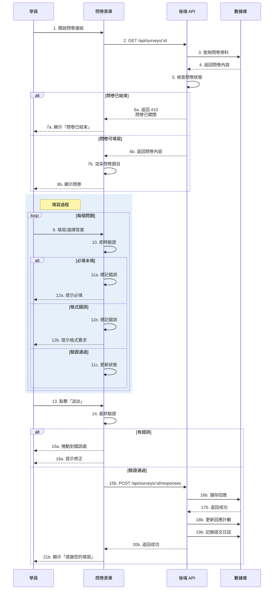

---

## 權限檢查流程

### RBAC 權限驗證

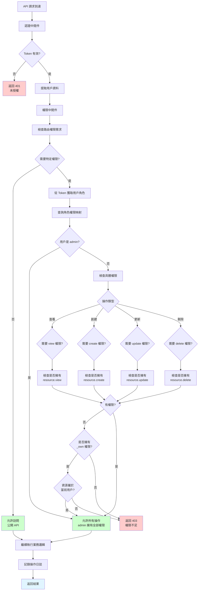

### 角色權限矩陣

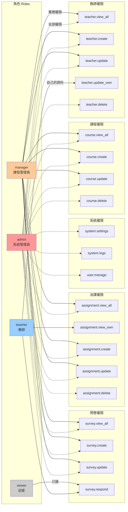

---

## 數據流架構

### 請求生命週期

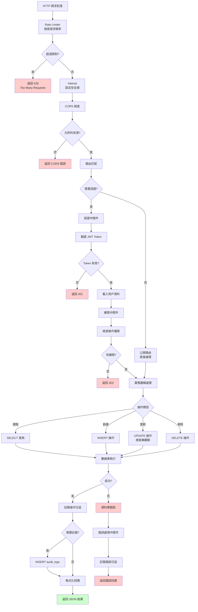

### 數據庫 ER 關係圖（簡化版）

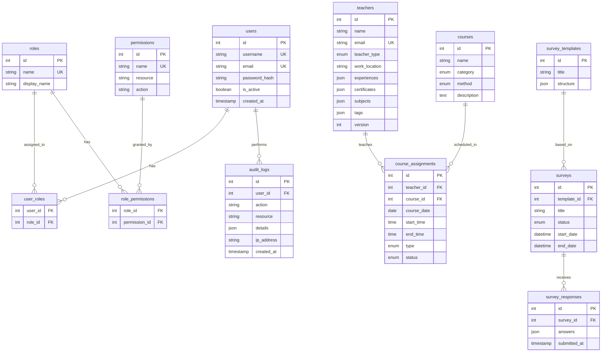

---

## 📊 關鍵性能指標

### API 回應時間目標
- **認證 API**: < 200ms
- **查詢 API**: < 300ms
- **寫入 API**: < 500ms
- **複雜查詢**: < 1000ms

### 安全限制
- **登錄限流**: 5 次/分鐘/IP
- **API 限流**: 100 次/分鐘/Token
- **Token 有效期**: 7 天
- **密碼強度**: 最少 8 字元，包含大小寫和數字

### 數據庫性能
- **連接池**: 10 連接
- **查詢超時**: 30 秒
- **樂觀鎖**: version 字段防止並發衝突

---

## 🔗 相關文檔

- [完整系統文檔](./README.md)
- [快速開始指南](./QUICK_START.md)
- [Azure 部署指南](./AZURE_SETUP.md)
- [API 參考文檔](./API_REFERENCE.md)
- [檢查清單](./CHECKLIST.md)

---

**文檔版本**: 1.0
**最後更新**: 2025-11-07
**系統版本**: teacher-roster v2.0
