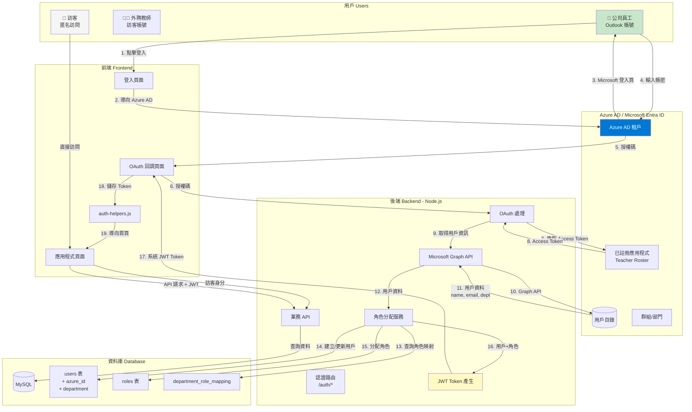
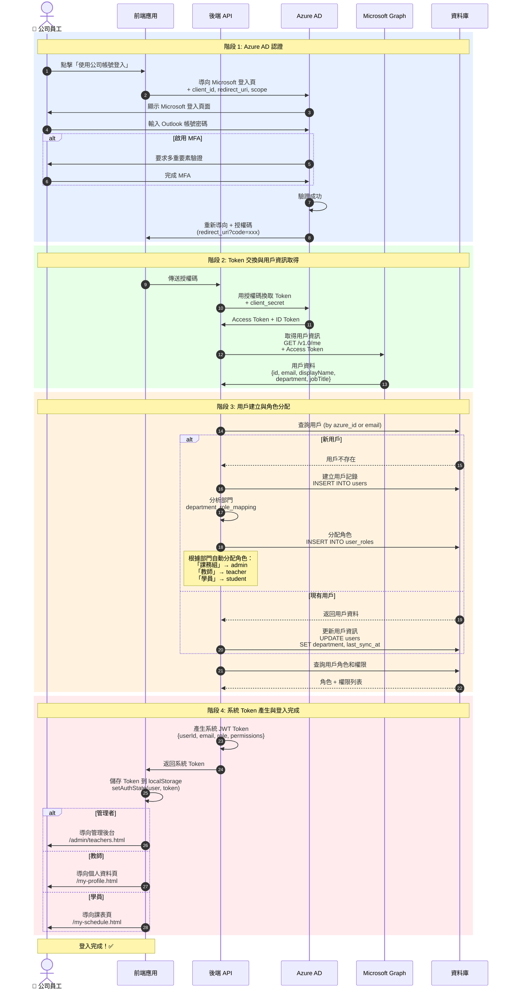
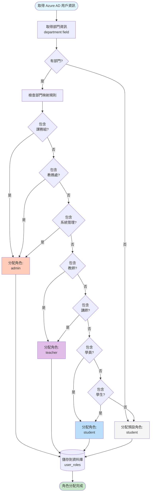
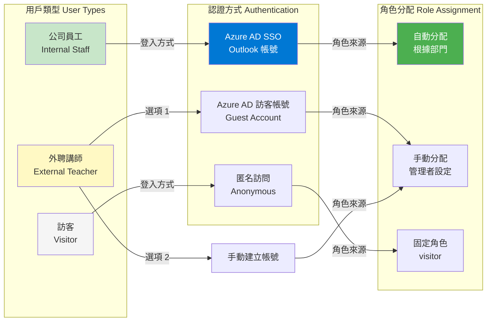
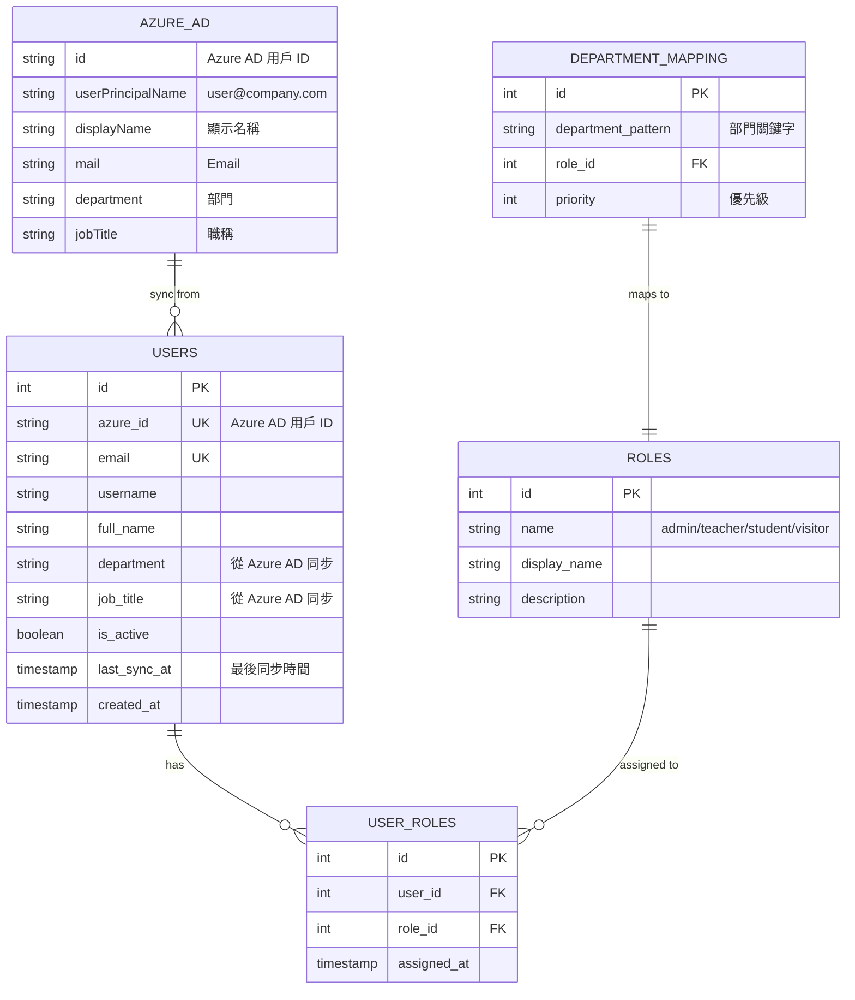
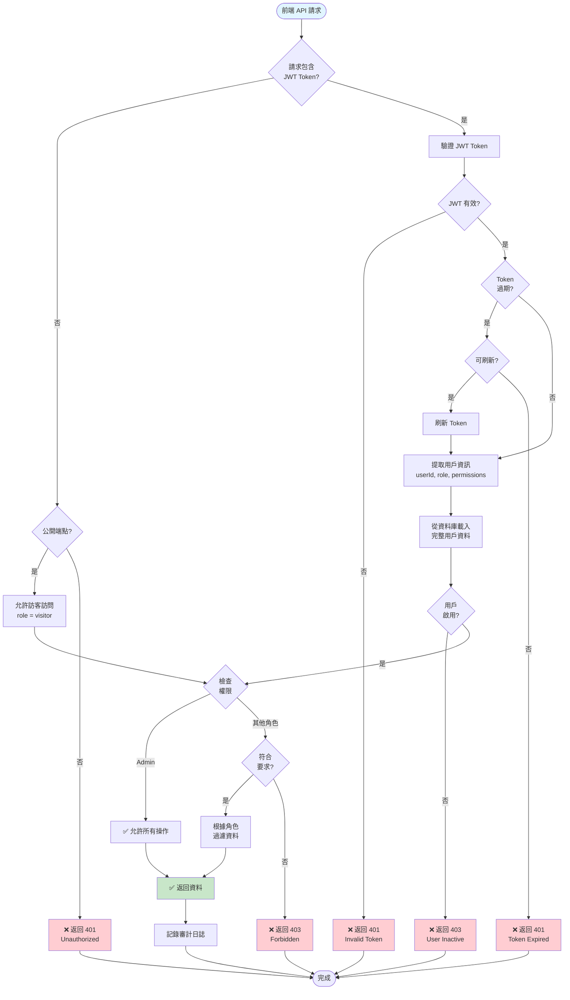
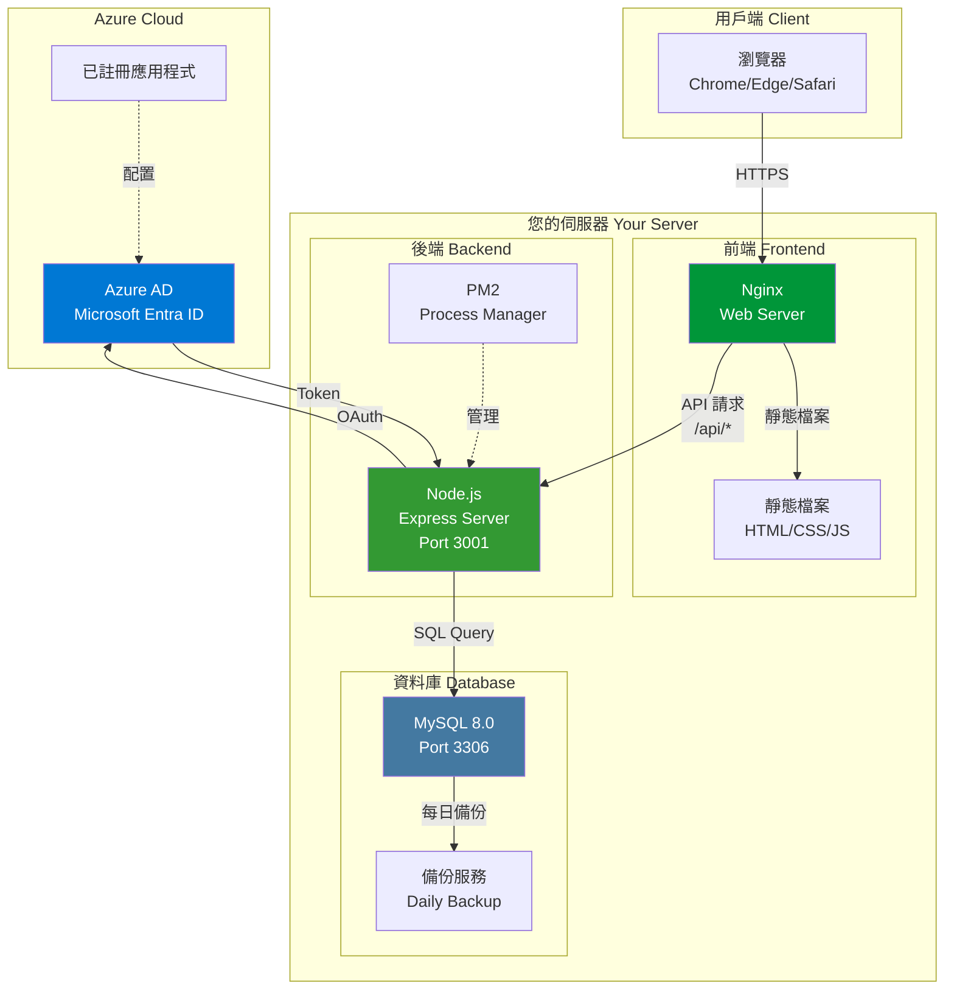
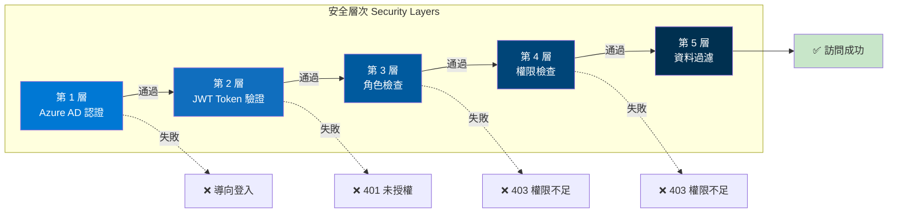
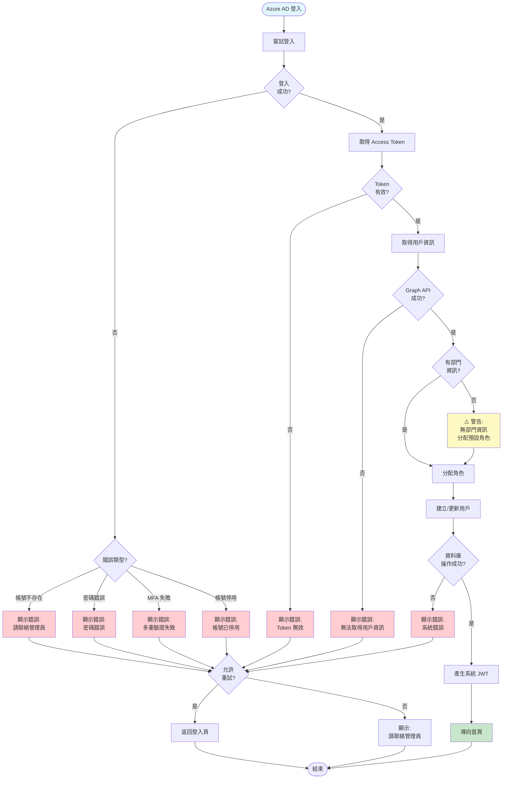

# Azure AD 整合架構圖

使用 Mermaid 圖表展示 Azure AD 單一登入（SSO）整合後的完整架構。

---

## 1. 整體系統架構（整合 Azure AD）

---

## 2. Azure AD 登入流程（詳細序列圖）

---

## 3. 角色自動分配流程

---

## 4. 用戶類型與登入方式

---

## 5. 資料庫結構（整合 Azure AD）

---

## 6. API 請求認證流程（整合 Azure AD Token）

---

## 7. 部署架構圖

---

## 8. 安全架構層次

---

## 9. 錯誤處理流程

---

## 使用說明

這些圖表使用 Mermaid 語法，可以在以下環境中查看：

1. **GitHub**: 直接在 GitHub 上查看此 Markdown 文件
2. **VS Code**: 安裝 Mermaid Preview 擴充套件
3. **線上編輯器**:
   - https://mermaid.live/
   - https://mermaid-js.github.io/mermaid-live-editor/

## 圖表說明

| 圖表編號 | 圖表名稱 | 用途 |
|---------|---------|------|
| 1 | 整體系統架構 | 了解 Azure AD 整合後的完整架構 |
| 2 | Azure AD 登入流程 | 詳細的登入序列圖 |
| 3 | 角色自動分配流程 | 了解如何根據部門分配角色 |
| 4 | 用戶類型與登入方式 | 不同用戶的認證方式 |
| 5 | 資料庫結構 | Azure AD 整合後的資料庫設計 |
| 6 | API 請求認證流程 | 包含 Token 驗證和權限檢查 |
| 7 | 部署架構圖 | 生產環境的部署架構 |
| 8 | 安全架構層次 | 多層安全防護機制 |
| 9 | 錯誤處理流程 | 登入過程的錯誤處理 |

## 相關文件

- [AZURE-AD-INTEGRATION.md](AZURE-AD-INTEGRATION.md) - Azure AD 整合詳細規劃
- [RBAC-PLANNING.md](RBAC-PLANNING.md) - RBAC 系統規劃
- [ARCHITECTURE-DIAGRAMS.md](examples/ARCHITECTURE-DIAGRAMS.md) - 基礎架構圖
