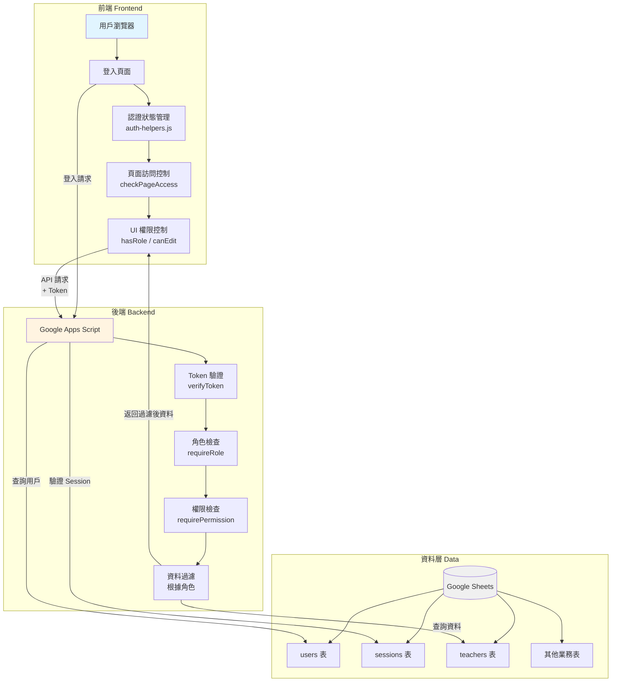
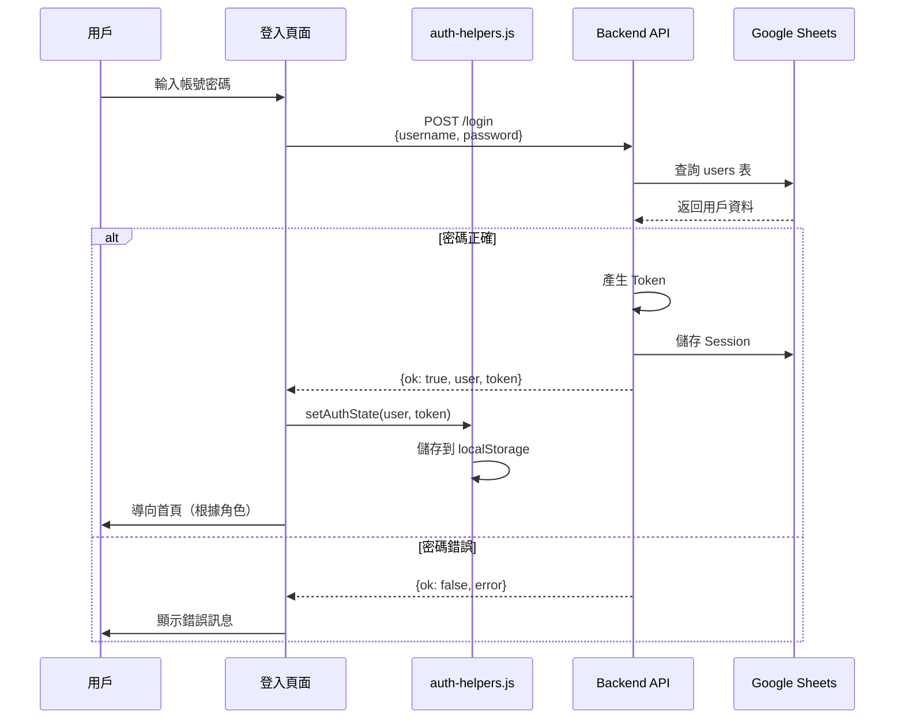
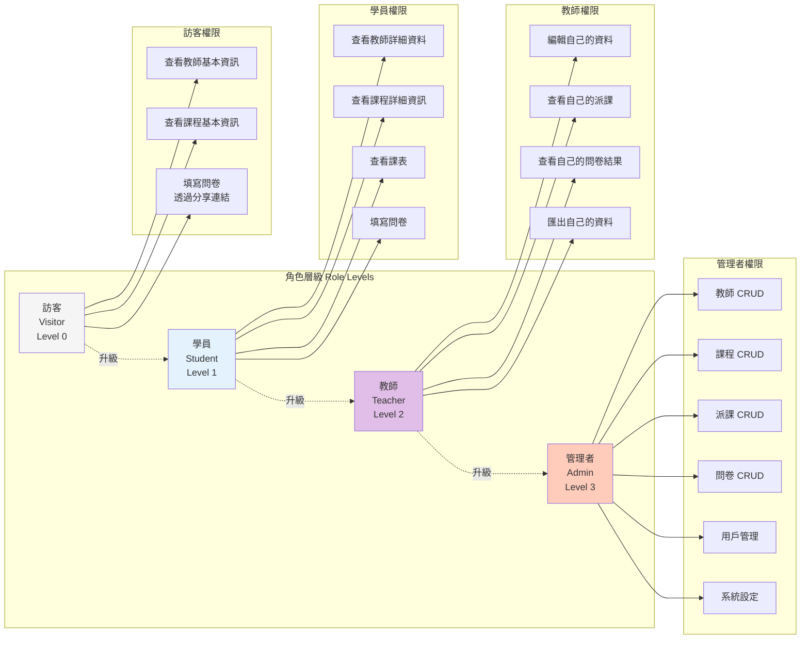
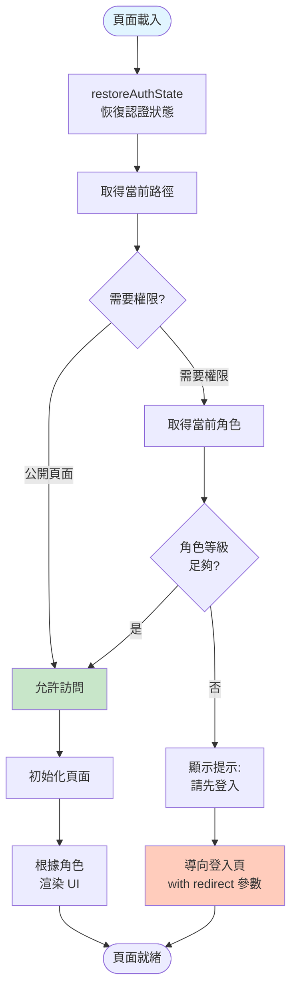
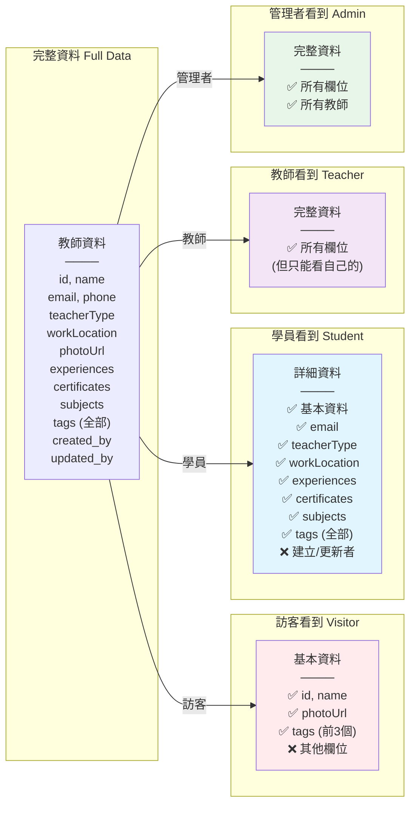
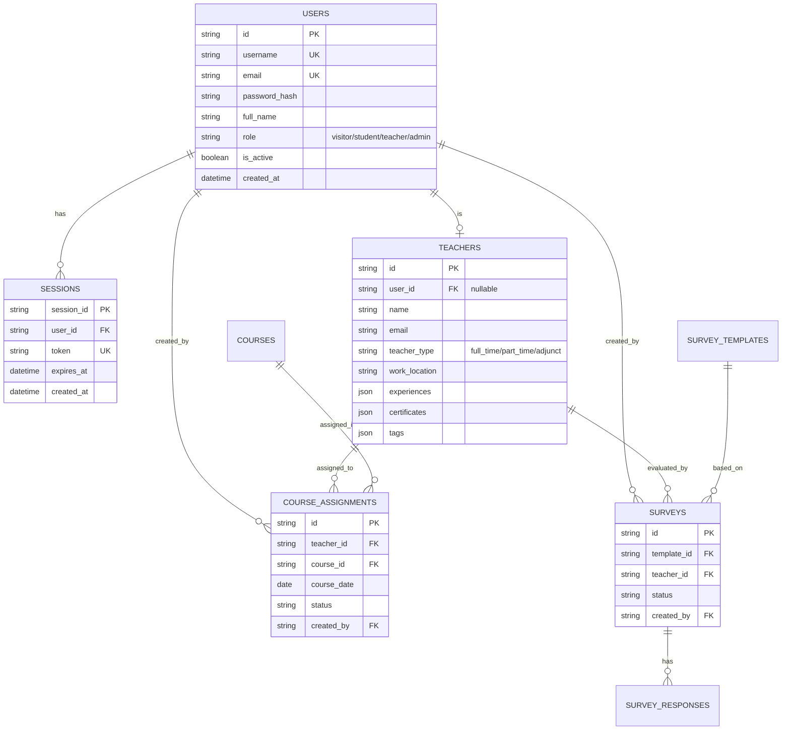
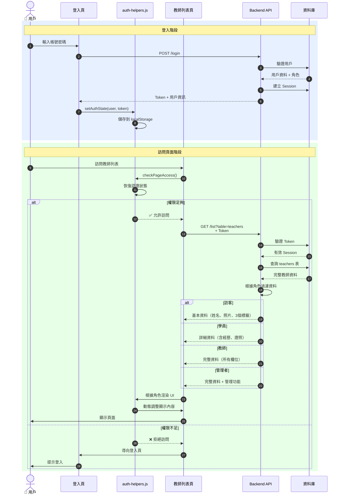
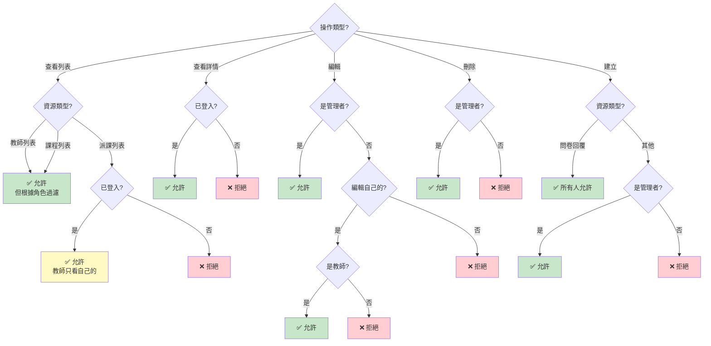
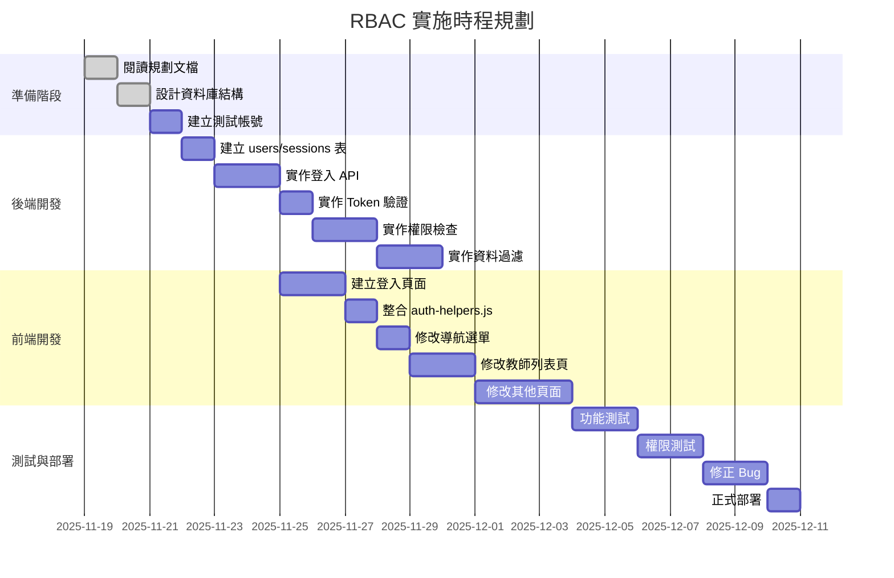

# RBAC 架構圖與流程圖

本文檔使用 Mermaid 圖表展示 RBAC 系統的架構和流程。

> **提示**：這些圖表在支援 Mermaid 的 Markdown 編輯器中可以渲染（如 GitHub、VS Code with Mermaid extension）

---

## 1. 系統整體架構



---

## 2. 用戶登入流程



---

## 3. API 請求權限驗證流程

```mermaid
flowchart TD
    Start([API 請求]) --> GetToken{攜帶 Token?}

    GetToken -->|否| SetVisitor[設定為訪客角色]
    GetToken -->|是| VerifyToken[驗證 Token]

    VerifyToken --> ValidToken{Token 有效?}
    ValidToken -->|否| Error1[返回錯誤:<br/>無效的 Token]
    ValidToken -->|是| CheckExpiry{是否過期?}

    CheckExpiry -->|是| Error2[返回錯誤:<br/>Token 已過期]
    CheckExpiry -->|否| GetUser[從 DB 取得用戶資料]

    GetUser --> CheckActive{用戶啟用?}
    CheckActive -->|否| Error3[返回錯誤:<br/>用戶已停用]
    CheckActive -->|是| SetAuthInfo[設定 authInfo<br/>{userId, role, permissions}]

    SetVisitor --> CheckPermission
    SetAuthInfo --> CheckPermission{檢查權限}

    CheckPermission -->|Admin| AllowAll[允許所有操作]
    CheckPermission -->|其他角色| CheckRole{符合要求?}

    CheckRole -->|是| FilterData[根據角色過濾資料]
    CheckRole -->|否| Error4[返回錯誤:<br/>權限不足]

    FilterData --> Success[返回資料]
    AllowAll --> Success

    Error1 --> End([結束])
    Error2 --> End
    Error3 --> End
    Error4 --> End
    Success --> End

    style Start fill:#e1f5ff
    style Success fill:#c8e6c9
    style Error1 fill:#ffcdd2
    style Error2 fill:#ffcdd2
    style Error3 fill:#ffcdd2
    style Error4 fill:#ffcdd2
```

---

## 4. 角色權限層級結構



---

## 5. 前端頁面訪問控制流程



---

## 6. 教師資料查詢與過濾



---

## 7. 前端 UI 權限控制邏輯

```mermaid
flowchart TD
    Start([渲染教師卡片]) --> GetRole[取得當前角色]

    GetRole --> RenderBase[渲染基本資訊<br/>姓名、照片]

    RenderBase --> CheckVisitor{是訪客?}
    CheckVisitor -->|是| LimitTags[只顯示 3 個標籤]
    CheckVisitor -->|否| ShowType[顯示教師類型]

    LimitTags --> CheckViewDetail
    ShowType --> ShowAllTags[顯示所有標籤]

    ShowAllTags --> CheckViewDetail{可查看詳情?}

    CheckViewDetail -->|是<br/>hasRole student+| AddViewBtn[加入<br/>[查看詳情] 按鈕]
    CheckViewDetail -->|否| CheckEdit

    AddViewBtn --> CheckEdit{可編輯?}

    CheckEdit -->|是<br/>canEdit| AddEditBtn[加入<br/>[編輯] 按鈕]
    CheckEdit -->|否| CheckDelete

    AddEditBtn --> CheckDelete{可刪除?}

    CheckDelete -->|是<br/>hasRole admin| AddDeleteBtn[加入<br/>[刪除] 按鈕]
    CheckDelete -->|否| Done

    AddDeleteBtn --> Done([渲染完成])

    style Start fill:#e1f5ff
    style Done fill:#c8e6c9
```

---

## 8. 資料表關聯圖



---

## 9. 完整登入到訪問資料流程



---

## 10. 權限檢查決策樹



---

## 11. 實施步驟流程圖



---

## 使用說明

這些圖表可以在以下環境中查看：

1. **GitHub**：直接在 GitHub 上查看此 Markdown 文件
2. **VS Code**：安裝 Mermaid 擴充套件
3. **線上編輯器**：
   - https://mermaid.live/
   - https://mermaid-js.github.io/mermaid-live-editor/

複製圖表代碼到這些編輯器中即可渲染出視覺化圖表。

---

## 圖表說明

| 圖表編號 | 圖表名稱 | 用途 |
|---------|---------|------|
| 1 | 系統整體架構 | 了解前後端和資料層的關係 |
| 2 | 用戶登入流程 | 了解登入過程的交互 |
| 3 | API 請求權限驗證流程 | 了解後端如何驗證權限 |
| 4 | 角色權限層級結構 | 了解各角色的權限範圍 |
| 5 | 前端頁面訪問控制流程 | 了解前端如何控制頁面訪問 |
| 6 | 教師資料查詢與過濾 | 了解不同角色看到的資料差異 |
| 7 | 前端 UI 權限控制邏輯 | 了解 UI 元素的顯示邏輯 |
| 8 | 資料表關聯圖 | 了解資料庫結構 |
| 9 | 完整登入到訪問資料流程 | 了解端到端的完整流程 |
| 10 | 權限檢查決策樹 | 了解各種操作的權限判斷 |
| 11 | 實施步驟流程圖 | 了解實施的時程規劃 |

---

## 相關文件

- [RBAC-PLANNING.md](../RBAC-PLANNING.md) - 完整規劃文檔
- [README.md](README.md) - 範例使用說明
- [auth-helpers.js](auth-helpers.js) - 前端權限控制
- [backend-rbac-example.gs](backend-rbac-example.gs) - 後端權限控制
